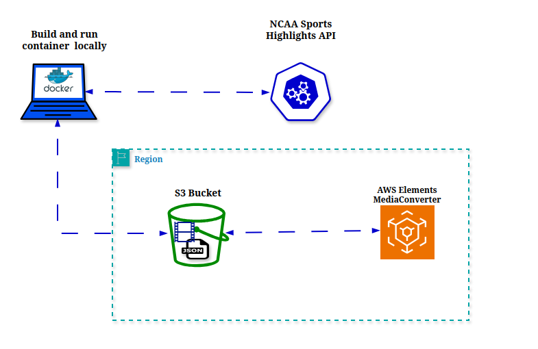

# 30 Day DevOps Challenge || Week 02 Day 02

# NCAA-Game-Highlights-Processsor

## Highlights Processor
This project uses RapidAPI to obtain NCAA game highlights using a Docker container and uses AWS Media Convert to convert the media file.

## Project Files Overview
### Main files
**1. config.py script:** Initializes and imports all environment variables and configuration files 

**2. fetch.py script:** Fetchs highlights data from RapidAPI and saves the results to S3 as json

**3. process_one_video.py script:** Extracts video url from json file in S3 and downloads video from the internet and saves to S3. 

**4. mediaconvert_process.py** Processes video files and stores the videos back to S3 

**5. run_all.py performs:** Runs all the scripts in a chronological order and provides buffer time for the tasks to be created.

**6. Dockerfile:** Provides all the  steps  to build and run a docker container.

### Terraform files

**Terraform Scripts:**


## Prerequisites
Before running the scripts, ensure you have the following:

- 1. Rapidapi.com API key: will be needed to access highlight images and videos.

[Sports Highlights API](https://rapidapi.com/highlightly-api-highlightly-api-default/api/sport-highlights-api/playground/apiendpoint_16dd5813-39c6-43f0-aebe-11f891fe5149) is the 

- 2. Docker: Make sure Docker is installed

- 3  AWS CLI:  Installed and congigured 

- 4 Python: Python  should be installed


## **Architecture**


## **Project Structure**
```bash
src/
├── Dockerfile
├── config.py
├── fetch.py
├── mediaconvert_process.py
├── process_one_video.py
├── requirements.txt
├── run_all.py
├── .env
├── .gitignore
└── terraform/
    ├── main.tf
    ├── variables.tf
    ├── secrets.tf
    ├── iam.tf
    ├── ecr.tf
    ├── ecs.tf
    ├── s3.tf
    ├── container_definitions.tpl
    └── outputs.tf
```


## **Step 1: Clone The Repo**
```bash
git clone https://github.com/kodcapsule/NCAA-Game-Highlights-Processsor.git
cd src
```
## **Step 2: Add API Key to AWS Secrets Manager**
```bash
aws secretsmanager create-secret \
    --name my-api-key \
    --description "API key for accessing the Sport Highlights API" \
    --secret-string '{"api_key":"YOUR_ACTUAL_API_KEY"}' \
    --region us-east-1
```

## **Step 3: Create an IAM role or user**

In the search bar type "IAM" 

Click Roles -> Create Role

For the Use Case enter "S3" and click next

Under Add Permission search for AmazonS3FullAccess, MediaConvertFullAccess and AmazonEC2ContainerRegistryFullAccess and click next

Under Role Details, enter "HighlightProcessorRole" as the name

Select Create Role

Find the role in the list and click on it
Under Trust relationships
Edit the trust policy to this:
Edit the Trust Policy and replace it with this:
```bash
{
  "Version": "2012-10-17",
  "Statement": [
    {
      "Effect": "Allow",
      "Principal": {
        "Service": [
          "ec2.amazonaws.com",
          "ecs-tasks.amazonaws.com",
          "mediaconvert.amazonaws.com"
        ],
        "AWS": "arn:aws:iam::<"your-account-id">:user/<"your-iam-user">"
      },
      "Action": "sts:AssumeRole"
    }
  ]
}
```

## **Step 4: Update .env file**
Update the .env file with the following details

1. RapidAPI_KEY: Ensure that you have successfully created the account and select "Subscribe To Test" in the top left of the Sports Highlights API
2. AWS_ACCESS_KEY_ID=your_aws_access_key_id_here
3. AWS_SECRET_ACCESS_KEY=your_aws_secret_access_key_here
4. S3_BUCKET_NAME=your_S3_bucket_name_here
5. MEDIACONVERT_ENDPOINT=https://your_mediaconvert_endpoint_here.amazonaws.com
```bash
aws mediaconvert describe-endpoints
```
6. MEDIACONVERT_ROLE_ARN=arn:aws:iam::your_account_id:role/HighlightProcessorRole

## **Step 5: Secure .env file**
```bash
chmod 600 src/.env
```
## **Step 6:Build & Run  Docker Container Locally**
1. Build image: 
```bash
docker build -t highlight-processor src/.
```
2. Check image: 
```bash
docker images
```

3. Run the Docker Container Locally:
```bash
docker run --env-file src/.env highlight-processor
```
           
This will run fetch.py, process_one_video.py and mediaconvert_process.py and the following files should be saved in your S3 bucket:

Optional - Confirm there is a video uploaded to s3://<your-bucket-name>/videos/first_video.mp4

Optional - Confirm there is a video uploaded to s3://<your-bucket-name>/processed_videos/

### **What We Learned**
1. Working with Docker and AWS Services
2. Identity Access Management (IAM) and least privilege
3. How to enhance media quality 

### **Future Enhancements**
1. Using Terraform to enhance the Infrastructure as Code (IaC)
2. Increasing the amount of videos process and converted with AWS Media Convert
3. Change the date from static (specific point in time) to dyanmic (now, last 30 days from today's date,etc)

# Part 2 - Terraform Bonus

### **Setup terraform.tfvars File**
1. In the github repo, there is a resources folder and copy the entire contents
2. In the AWS Cloudshell or vs code terminal, create the file vpc_setup.sh and paste the script inside.
3. Run the script
```bash
bash vpc_setup.sh
```
4. You will see variables in the output, paste these variables into lines 8-13.
5. Store your API key in AWS Secrets Manager
```bash
aws ssm put-parameter \
  --name "/myproject/rapidapi_key" \
  --value "YOUR_SECRET_KEY" \
  --type SecureString
```
6.  Run the following script to obtain your mediaconvert_endpoint:
```bash
aws mediaconvert describe-endpoints
```
7. Leave the mediaconvert_role_arn string empty

Helpful Tip for Beginners:
1. Use the same region, project, S3 Bucketname and ECR Repo name to make following along easier. Certain steps like pushing the docker image to the ECR repo is easier to copy and paste without remember what you named your repo :)

### **Run The Project**
1.  Navigate to the terraform folder/workspace in VS Code
From the src folder
```bash
cd terraform
```
2. Initialize terraform working directory
```bash
terraform init
```
3. Check syntax and validity of your Terraform configuration files
```bash
terraform validate
```
4. Display execution plan for the terraform configuration
```bash
terraform plan
```
5. Apply changes to the desired state
```bash
terraform apply -var-file="terraform.dev.tfvars"
```
6.Build the docker image for AWS deployment - ensure you are at the src folder 
```bash
docker build -t highlight-pipeline:latest .
docker tag highlight-pipeline:latest <AWS_ACCOUNT_ID>.dkr.ecr.<REGION>.amazonaws.com/highlight-pipeline:latest
```
7.Log into ECR & Push
```bash
aws ecr get-login-password --region us-east-1 | \
  docker login --username AWS --password-stdin <AWS_ACCOUNT_ID>.dkr.ecr.us-east-1.amazonaws.com

docker push <AWS_ACCOUNT_ID>.dkr.ecr.<REGION>.amazonaws.com/highlight-pipeline:latest
```

### **Destroy ECS and ECR resources**
1. In the AWS Cloudshell or vs code terminal, create the file ncaaprojectcleanup.sh and paste the script inside from the resources folder.
3. Run the script
```bash
bash ncaaprojectcleanup.sh
```
### **Review Video Files**
1. Navigate to the S3 Bucket and confirm there is a json video in the highlights folder and a video in the videos folder

### **What We Learned**
1. Deploying local docker images to ECR 
2. A high level overview of terraform files
3. Networking - VPCs, Internet Gateways, private subnets and public subnets
4. SSM for saving secrets and pulling into terraform

### **Future Enhancements**
1. Automating the creation of VPCs/networking infra, media endpoint


